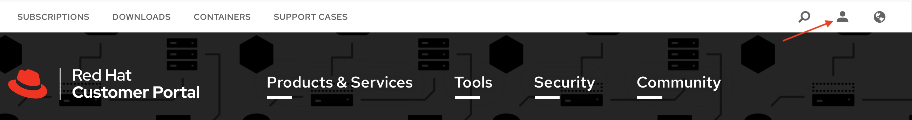
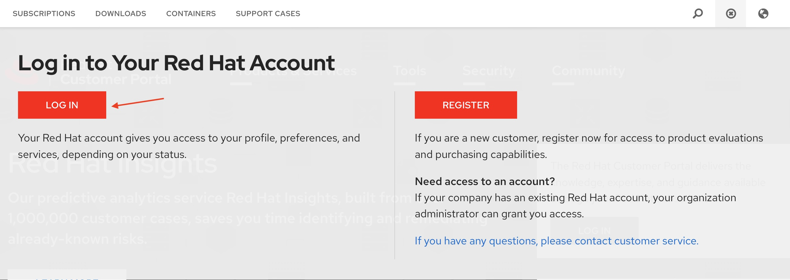
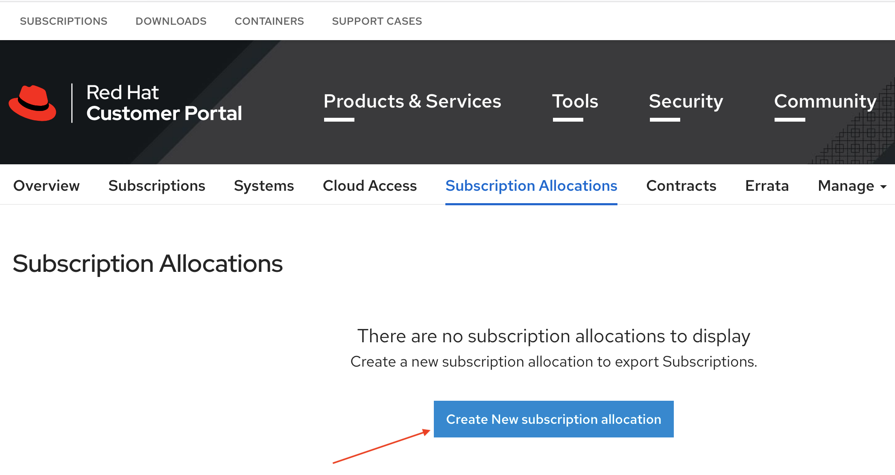
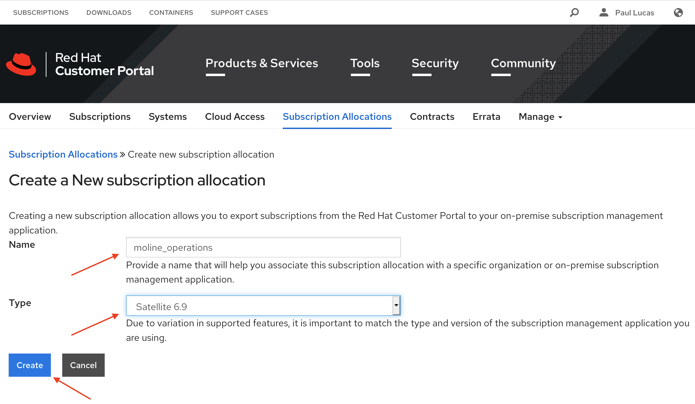
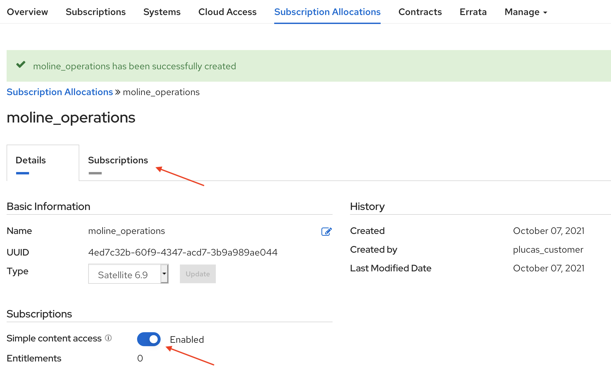
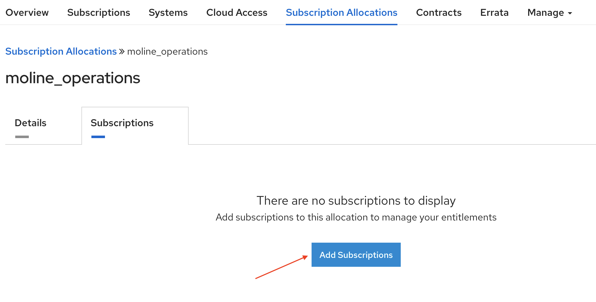
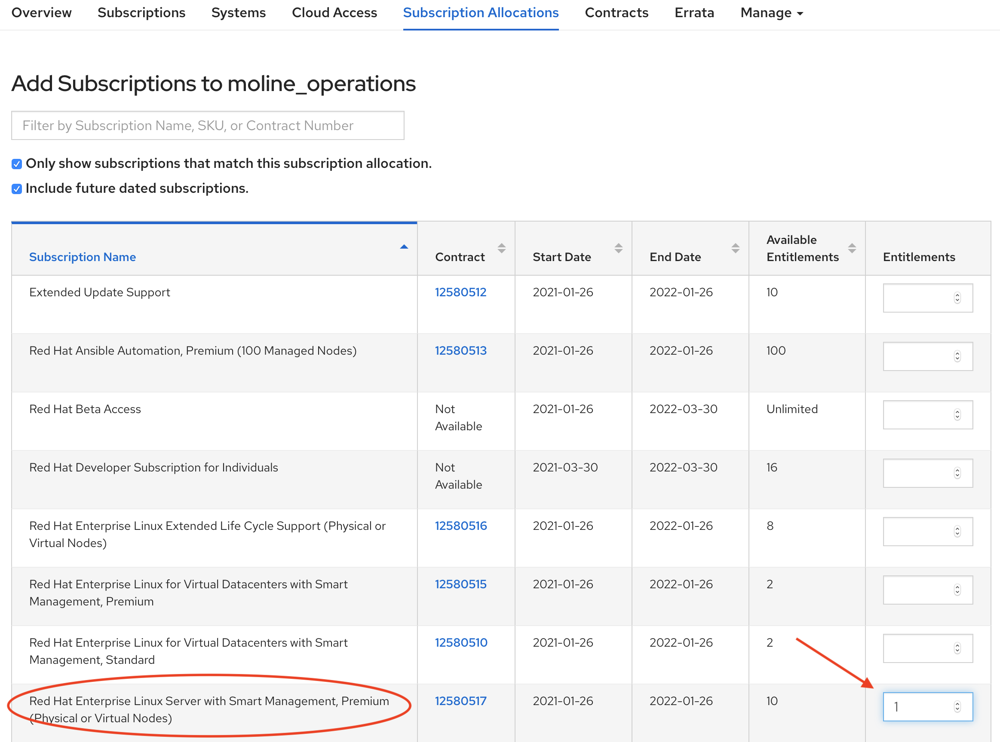
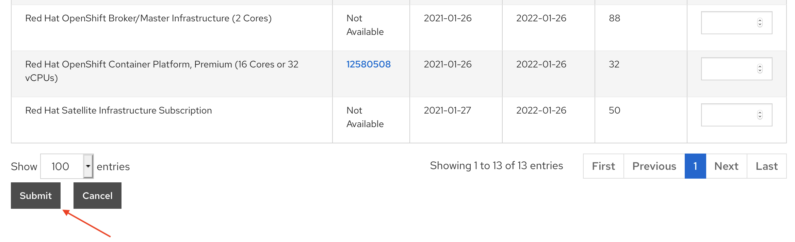
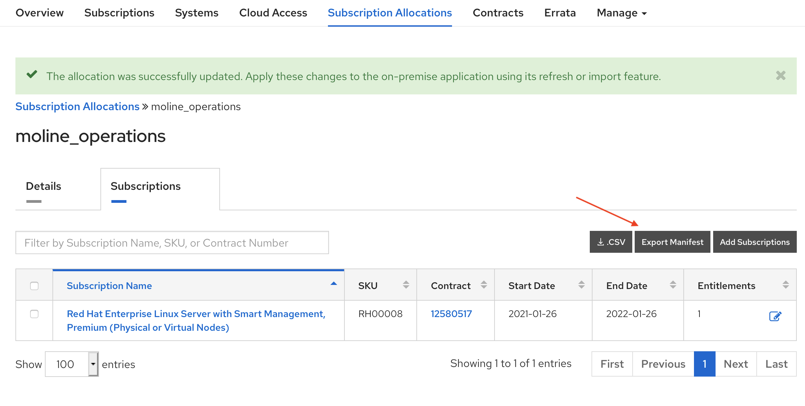

# Preparing the Satellite Environment

In Part A of the tutorial we will prepare the Satellite environment.  Note: We have Simple Content Access enabled on our customer portal and with any manifests that we create.  See this article to enable Simple Content Access - [add sca reference link here]

### Create a Manifest for Satellite
Go to [https://access.redhat.com/](https://access.redhat.com/) and login to your Red Hat customer account.  

Click the person icon in the upper right corner of the Red Hat customer portal page.  

  

Next click on the red login button.  

  

In the Login in to Red Hat dialog box, enter your Red Hat login or email and click the Red next button.  Enter your password and the Password field and click the Red Login button.  

On your Red Hat portal customer page, click the Subscriptions tab in the upper left side of the screen.  

  

Click the Subscription Allocations tab found near the top middle portion of the Red Hat Customer Portal.  

  

Click the blue Create New subscription allocation button.  

  

On the Create a New Subscription Allocation page give the manifest a name and chose the version of Satellite that will use the manifest.  In our example we are creating manifest for the Moline Operations team and adding the manifest to our Satellite 6.9 environment.  Click the blue Create button to continue.

  

On the Subscription Allocations >> moline_operations page make that Simple content access is enabled and click on the Subscriptions tab.  

  

On the Subscriptions tab click blue Add Subscriptions button.  

  

On the Add Subscriptions to moline_operations page you will see subscriptions available to add to the manifest.  Since we have Simple Content Access enabled we only need to add one subscription per Red Hat product to the manifest.  For this example we are adding one subscription for RHEL Premium with Smart Management. 

  

If needed scroll down and click the submit button. 

  

Click the Export Manifest button to download the manifest that you just created.

 

We can now logout of the Red Hat customer portal.  

### Creating an Organization and Importing the Manifest in Satellite

Login to the Satellite console by entering [http://sat01.example.com](http://sat01.example.com) for the Satellite url.  Satellite will redirect the browser to Satellite's secure login page.  You will need to accept Satellite's certificate for your browser.  

Enter the user id and password and click Login button.  

  

You are now at the Satellite home screen.  

  

Before we import the manifest, we will first create an Organization in Satellite.  Organizations are used to manage content related functions such product management, repositories and content views.  Satellite can support mutliple organziations if that makes sense for your envionrment.  Maybe you want to split content between US and European based manufacturing with two organizational views.  You might create Ogranizations based on business units or deparatments.  In this tutorial we will create an organzation for the operations organization.  

On the side menu click Adminster -> Organziations.  

  

On the Organizations page click the blue New Organization button in the upper right of the Satellite console.

 

Fill in the Name and Label fieds and click the blue Submit button.  

 

You will now see the Organziations > Edit Operations Department page.  Click the cancel button.

Now we will add a location for our organization. We can use a location to logically map geographically separate to an organzation.  On the side menu click Adminster -> Locations.  

   

On the Locations page click the blue New Location button located towards the top right of the screen.  

 

Fill in the Name field and optionally add a description.  Now click the blue Submit button to create the location.  

 

After clicking the blue Submit button you will be returned to the Locations > Edit Moline page.  

We will now import the manifest into Satellite for Operaions organziation.  

On the side menu click Content -> Subscriptions.  

   

Before we import the manifest into Satellite, make sure Satellite is set to the Operations Department organizationa and the moline location.  You will see the current organization and location near the top left of the Satellite Console.  If the Operations Department and moline are not set as the organziation and location, click on each respective drop down to chose them.  

Click on the blue Import a Manfiest button.  

   

