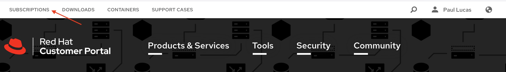

# Preparing the Satellite Environment

In Part A of the tutorial we will prepare the Satellite environment.  Note: We have Simple Content Access enabled on our customer portal and with any manifests that we create.  See this article to enable Simple Content Access - [add sca reference link here]

### Create a Manifest for Satellite
Go to [https://access.redhat.com/](https://access.redhat.com/) and login to your Red Hat customer account.  

Click the person icon in the upper right corner of the Red Hat customer portal page.  

  

Next click on the red login button.  

  

In the Login in to Red Hat dialog box, enter your Red Hat login or email and click the Red next button.  Enter your password and the Password field and click the Red Login button.  

On your Red Hat portal customer page, click the Subscriptions tab in the upper left side of the screen.  

  

Click the Subscription Allocations tab found near the top middle portion of the Red Hat Customer Portal.  

  

Click the blue Create New subscription allocation button.  

  

On the Create a New Subscription Allocation page give the manifest a name and chose the version of Satellite that will use the manifest.  In our example we are creating manifest for the Moline Operations team and adding the manifest to our Satellite 6.9 environment.  Click the blue Create button to continue.

  
