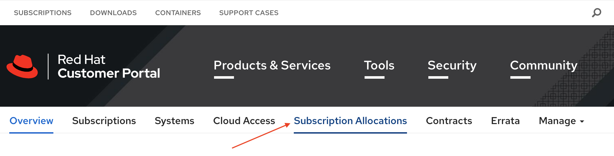

# Preparing the Satellite Environment

In Part A of the tutorial we will prepare the Satellite environment.  Note: We have Simple Content Access enabled on our customer portal and with any manifests that we create.  See this article to enable Simple Content Access - [add sca reference link here]

### Create a Manifest for Satellite
Go to [https://access.redhat.com/](https://access.redhat.com/) and login to your Red Hat customer account.  

Click the person icon in the upper right corner of the Red Hat customer portal page.  

  

Next click on the red login button.  

  

In the Login in to Red Hat dialog box, enter your Red Hat login or email and click the Red next button.  Enter your password and the Password field and click the Red Login button.  

On your Red Hat portal customer page, click the Subscriptions tab in the upper left side of the screen.  

  

Click the Subscription Allocations tab found near the top middle portion of the Red Hat Customer Portal.  

  

Click the blue Create New subscription allocation button.  

  

On the Create a New Subscription Allocation page give the manifest a name and chose the version of Satellite that will use the manifest.  In our example we are creating manifest for the Moline Operations team and adding the manifest to our Satellite 6.9 environment.  Click the blue Create button to continue.

  

On the Subscription Allocations >> moline_operations page make that Simple content access is enabled and click on the Subscriptions tab.  

  

On the Subscriptions tab click blue Add Subscriptions button.  

  

On the Add Subscriptions to moline_operations page you will see subscriptions available to add to the manifest.  Since we have Simple Content Access enabled we only need to add one subscription per Red Hat product to the manifest.  For this example we are adding one subscription for RHEL Premium with Smart Management. 

  

If needed scroll down and click the submit button. 

  

Click the Export Manifest button to download the manifest that you just created.

 

We can now logout of the Red Hat customer portal.  

### Creating an Organization and Importing the Manifest in Satellite

Let's login to Satellite.  
